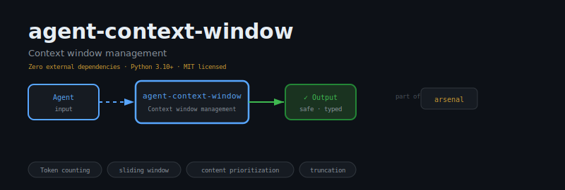
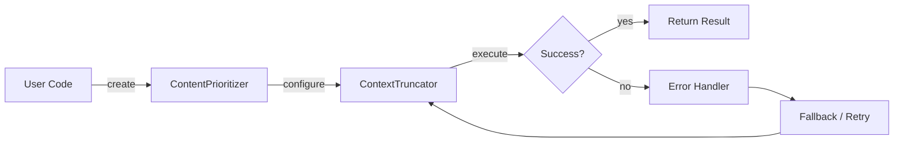
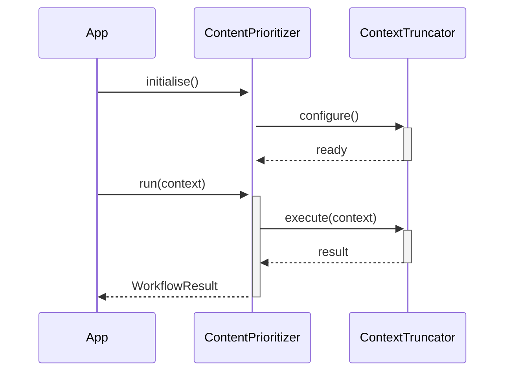

<div align="center">

</div>

# agent-context-window

**Context window management for LLM agents — token counting, sliding window, prioritization, and truncation.**

[](https://pypi.org/project/agent-context-window/) [](https://python.org) [](LICENSE) [](#)

---

## The Problem

Without context-window management, agents silently truncate earlier context as conversations grow — losing critical instructions, system prompts, or prior tool results. Token-aware management makes truncation explicit and controlled.

## Installation

```bash
pip install agent-context-window
```

## Quick Start

```python
from agent_context_window import ContentPrioritizer, ContextTruncator, _Message

# Initialise
instance = ContentPrioritizer(name="my_agent")

# Use
result = instance.run()
print(result)
```

## API Reference

### `ContentPrioritizer`

```python
class ContentPrioritizer:
    """Scores and re-ranks messages by their estimated importance.
    def __init__(self) -> None:
    def score(self, message: dict) -> float:
        """Score a single message's importance in [0.0, 1.0].
    def rerank(self, messages: list[dict]) -> list[dict]:
        """Return a *new* list sorted by importance (highest first).
```

### `ContextTruncator`

```python
class ContextTruncator:
    """Truncates text or message lists to fit within a token budget.
    def __init__(self, model: str = "gpt-4") -> None:
    def truncate(
```

### `_Message`

```python
class _Message:
    role: str
    def to_dict(self) -> dict:
```

### `ContextWindow`

```python
class ContextWindow:
    """Manages a sliding window of conversation messages within a token budget.
    def __init__(
    def _budget(self) -> int:
        """Usable token budget (max minus reserve)."""
    def token_usage(self) -> int:
        """Current approximate token usage of all stored messages."""
```


## How It Works

### Flow



### Sequence



## Philosophy

> The Gita was delivered in eighteen chapters of focused context; the context window honours that constraint.

---

*Part of the [arsenal](https://github.com/darshjme/arsenal) — production stack for LLM agents.*

*Built by [Darshankumar Joshi](https://github.com/darshjme), Gujarat, India.*
